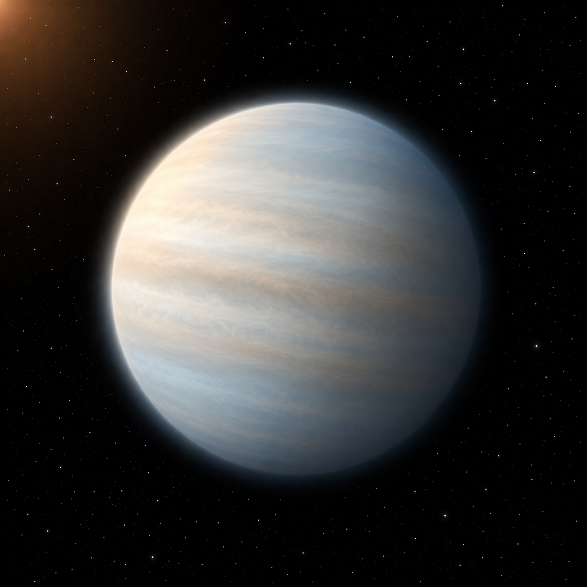

# WASP-107 b — Exoplanet Atmosphere Report
<!-- RESEARCH-IDENTITY-START -->
**Independent research report by [Biswajit Jana](https://biswajit1999.github.io/Biswajit_Jana.github.io/)** · [Live report](https://biswajit1999.github.io/wasp-107b-exoplanet-report/) · [ORCID](https://orcid.org/0009-0002-2411-1891) · [Complete research portfolio](https://biswajit1999.github.io/Biswajit_Jana.github.io/research/exoplanets/)
<!-- RESEARCH-IDENTITY-END -->


<p align="center">
  
</p>

<p align="center"><em>AI-generated artist's concept — not a real photograph. See the report for actual JWST NIRISS SOSS data.</em></p>

A puffy, low-density warm Neptune, and one of the clearest JWST
atmospheric detections to date: photochemically produced sulfur
dioxide, and methane at a fraction of the abundance simple chemistry
predicts. This repo pulls system parameters and a reduced JWST
transmission spectrum directly, with no synthetic placeholders.

**[Open the full report](https://biswajit1999.github.io/wasp-107b-exoplanet-report/)** — the live GitHub Pages version. You can also open `index.html` locally in a browser, or serve it with `python -m http.server` from this directory.

## Data sources

- **System parameters** — queried live from the NASA Exoplanet Archive TAP
  service (`pscomppars` table) for `WASP-107 b`.
- **Transmission spectrum** — reduced JWST NIRISS SOSS transit-depth
  vs. wavelength data (spectral orders 1 and 2), released publicly by
  Krishnamurthy et al. on Zenodo (record
  [10.5281/zenodo.17085766](https://doi.org/10.5281/zenodo.17085766)). See
  `data/` for the raw files exactly as downloaded.
- **Analysis** — `scripts/analyze_spectrum.py` loads the data, computes a
  weighted mean transit depth, RMS scatter, and peak-to-trough amplitude, and
  produces the spectrum + residuals figure in `figures/`. Run it yourself:

  ```bash
  pip install -r requirements.txt
  python scripts/analyze_spectrum.py
  ```

## Repository structure

```text
index.html              the report webpage
data/                    reduced JWST NIRISS SOSS spectrum files (Zenodo)
scripts/analyze_spectrum.py   analysis producing the figure + statistics
figures/                 generated plot + summary_statistics.csv
tests/                   unit tests + a regression check against the real data
```

## Tests

`tests/test_analysis.py` checks the weighted-mean formula against
hand-computed cases and reruns the full pipeline on the real
downloaded spectrum, verifying it still reproduces the numbers this
README documents. Runs automatically on every push via GitHub Actions;
run locally with:

```bash
pytest tests/ -v
```

## What the numbers show

143 wavelength bins across 0.6-2.8 microns, weighted mean transit depth
2.062% ± 0.0004%, with a rise toward the spectrum's blue and red edges
consistent with water-vapor absorption. The SO2 and methane results
discussed in [index.html](index.html) come from separate MIRI and
NIRSpec observations not included in this NIRISS dataset — stated
explicitly so this repo doesn't overclaim what one instrument's data
shows on its own.

## Limitations

Dyrek et al. (2024) reported only an upper limit on methane from MIRI;
a later NIRSpec study (Sing et al. 2024) detected it directly at 4.2σ,
depleted roughly three orders of magnitude below equilibrium
expectations — methane isn't absent, just severely depleted, and both
results are cited to avoid repeating the outdated "no methane" framing
of the earlier paper alone. The peak-to-trough amplitude quoted for
this spectrum is an extreme-value statistic with no uncertainty of its
own, more sensitive to a single noisy bin than a proper feature
measurement would be, and is reported descriptively rather than as a
calibrated result.

## References

1. Dyrek, A. et al., 2024. SO2, silicate clouds, but no CH4 detected in a warm
   Neptune with JWST. *Nature*, 625, pp.51-54.
2. Sing, D.K. et al., 2024. A warm Neptune's methane reveals core mass
   and vigorous atmospheric mixing. *Nature*, 630, pp.831-835
   (arXiv:2405.11027).
3. Krishnamurthy, V. et al. NIRISS-SOSS transmission-spectrum reduction of
   WASP-107 b. Zenodo record
   [10.5281/zenodo.17085766](https://doi.org/10.5281/zenodo.17085766).
4. Piaulet, C. et al., 2021. Evidence for a Large, Hot Core in the Warm
   Neptune WASP-107 b. *The Astronomical Journal*, 161, 70.
5. Sing, D.K. et al., 2019. Helium in the eroding atmosphere of an exoplanet.
   *The Astronomical Journal*, 158, 91.
6. NASA Exoplanet Archive, <https://exoplanetarchive.ipac.caltech.edu/> —
   system parameters, queried live via TAP.

## Author

Biswajit Jana — [Portfolio](https://biswajit1999.github.io/Biswajit_Jana.github.io/) · [GitHub](https://github.com/Biswajit1999) · [LinkedIn](https://www.linkedin.com/in/biswajit-jana-27011a151/) · [ORCID](https://orcid.org/0009-0002-2411-1891)
