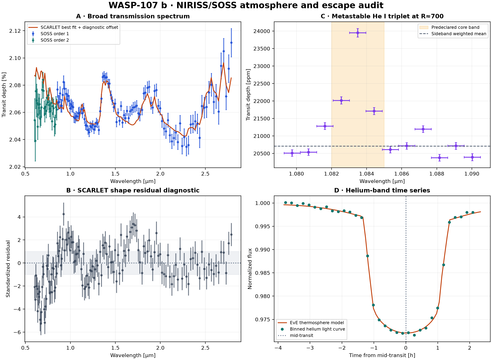

# WASP-107 b — NIRISS atmosphere and escape audit

**Independent reproducibility report by [Biswajit Jana](https://biswajit1999.github.io/Biswajit_Jana.github.io/)** · [Live report](https://biswajit1999.github.io/wasp-107b-exoplanet-report/) · [ORCID](https://orcid.org/0009-0002-2411-1891)

This repository audits all six public science products accompanying the
JWST/NIRISS-SOSS study of WASP-107 b by Krishnamurthy et al. It connects the
broad 0.6–2.8 µm transmission spectrum to the resolved metastable-helium
triplet and its time-dependent absorption. The peer-reviewed paper remains the
authority for retrieval and atmospheric-escape inference.

## Scientific result in context

The archive records a maximum helium-band transit depth of
23,952.8 ± 124.1 ppm at 1.08349 µm. A predeclared 1.082–1.085 µm core has a
weighted depth 1,685.4 ± 70.0 ppm above the remaining released R≈700 bins.
That 24.1-sigma diagonal contrast is a compact reproduction statistic, not a
replacement for the publication's time-correlated detection analysis.

Krishnamurthy et al. report continuous helium absorption beginning about
1.5 hours before ingress, including 17-sigma pre-transit absorption, and an
extended thermosphere spanning tens of planetary radii. They also retrieve
water at log10(H2O) = −2.5 ± 0.6 and attribute the short-wavelength slope to
unocculted stellar spots at 5.2 sigma rather than simply to haze.



## Reproducible audit

- Panel A: 143 SOSS order-1/order-2 bins and the released SCARLET best-fit
  atmosphere curve with one diagnostic vertical offset.
- Panel B: standardized residuals. Their RMS is 1.826; this is a warning that
  diagonal-error goodness-of-fit would be incomplete, not a retrieval result.
- Panel C: the 12-bin R≈700 helium spectrum and predeclared core contrast.
- Panel D: the binned helium light curve and released EvE thermosphere model.
  The archive provides no flux-uncertainty column, so only a descriptive
  312.1 ppm residual RMS is reported—no p-value.

Machine-readable outputs are
[`analysis_summary.json`](figures/analysis_summary.json),
[`broad_spectrum_residuals.csv`](figures/broad_spectrum_residuals.csv), and
[`summary_statistics.csv`](figures/summary_statistics.csv).

## Reproduce

```bash
python -m pip install -r requirements.txt
python scripts/validate_sources.py
python scripts/analyze_spectrum.py
pytest -q
ruff check .
```

The provenance manifest records the six Zenodo MD5 values and cross-platform
SHA-256 digests. No numeric source value is altered.

## Interpretation boundaries

- The core/sideband contrast uses the reported per-bin errors as independent;
  it does not model spectral covariance or the look-elsewhere effect.
- The SCARLET curve is a released best fit from a retrieval. Comparing it back
  to the same spectrum is a reproduction diagnostic, not independent
  validation or a model-selection calculation.
- The EvE light-curve residual has no calibrated significance because the
  released table omits flux uncertainties and covariance.
- SO2, CH4, CO2, CO, and NH3 results from MIRI/NIRSpec/NIRCam studies are useful
  panchromatic context but are not measured by these NIRISS files.

## Sources

- Krishnamurthy, V. et al., “Continuous helium absorption from both the
  leading and trailing tails of WASP-107 b,” *Nature Astronomy* 10, 258–270
  (2026), [arXiv:2505.20588](https://arxiv.org/abs/2505.20588).
- Six public products: [Zenodo 17085766](https://doi.org/10.5281/zenodo.17085766).
- System context: [NASA Exoplanet Archive](https://exoplanetarchive.ipac.caltech.edu/).

## Author

Biswajit Jana — [Portfolio](https://biswajit1999.github.io/Biswajit_Jana.github.io/) · [GitHub](https://github.com/Biswajit1999) · [ORCID](https://orcid.org/0009-0002-2411-1891)
